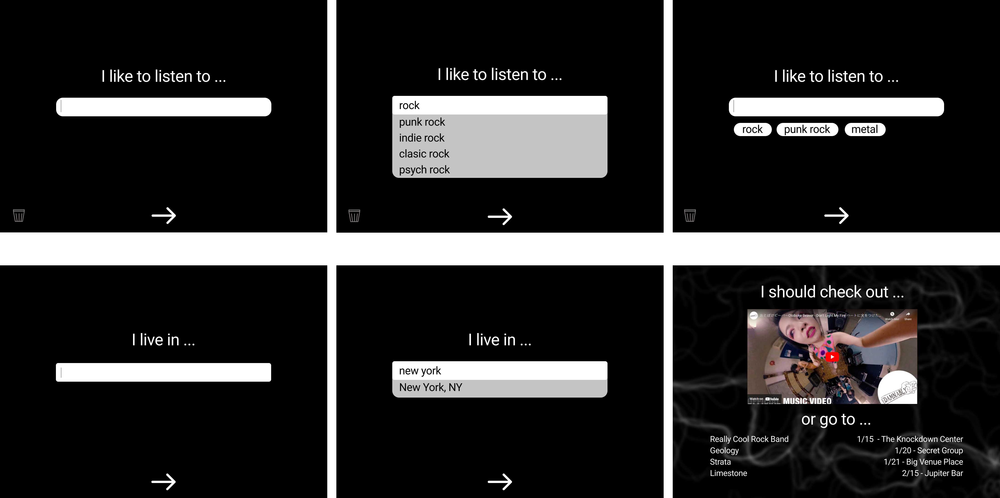
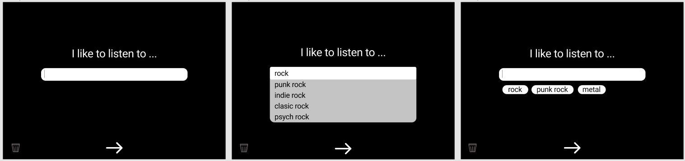
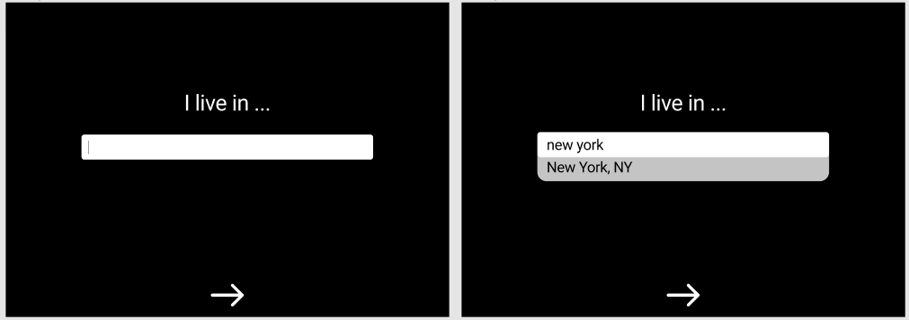

# Project Name - LocalBeats

## Project Summary
Listen to the music you love - on your phone, at work, or go check it out live. Select the genre of music you like and share your location - LocalBeats will hit you with videos, tracks, and live events in your area.    

## Developers
1. Dita Zanelli
2. Jamie Jackson
3. Buyankhishig Jamsran
4. Brad Kelley

## Installation Instructions
1. Log into GitHub repository - https://github.com/ditazan/Music
>> [repository image](./assets/images/repository.png)

2. Click on CODE button and copy ssh link - git@github.com:ditazan/Music.git 
>> The following image illustrates the process of copying the SSH link.
>> [illustration of how to copy SSH link to clone](./assets/images/clone-1.gif)

3. Open terminal application (e.g., Git Bash) and enter the following commands:
>> - cd [directory name where you want to store project files] (e.g., cd desktop/projects)
>> - git clone [paste copied link] (clone repository)

## Animated Gifs/Pictures of App

## Tech Stack
What languages is it written with: 
>> 1. HTML 5
>> 2. JavaScript
>> 3. CSS

What libraries are used: 
>> 1. P5 Creative Coding Language - https://p5js.org/
>> 2. Jquery - https://code.jquery.com/jquery-3.4.1.min.js

Other: 

## APIs
LocalBeats incorporates the following APIs from Ticketmaster and YouTube.

### Ticketmaster Classification API
Ticketmaster Entertainment, LLC. (www.Ticketmaster.com) is the world’s largest ticket marketer, offering access to 230K+ live events sourced from various platform, including Ticketmaster, Universe, FrontGate Tickets and Ticketmaster Resale (TMR). Ticketmaster utilizes a proprietary, hierarchical coding schema (segment, genre, sub-genre, type, sub-type) to classify events. This code set is published through Ticketmaster's "Classifications" endpoint, located at: 

>>> https://app.Ticketmaster.com/discovery/v2/classifications?apikey=[api key]&locale=*

The proposed application will leverage the genre “id” and “name” codes found within the “music” segment and “en-us” locale of the "Classifications" endpoint’s response. The image below provides an illustration of the JSON response from the API.  

>> [illustration of Ticketmaster Classification API](./assets/images/genre-1.png)

The music genres (i.e., “names”) returned by the Ticketmaster Classification API shall be used to populate a drop-down field in the application’s UI – providing users with a method for selecting the type of music they like. The image below provides a wireframe illustration of the drop-down field.

>> 

The genre(s) selected by the user shall be used as a parameter filter in the YouTube and Ticketmaster Events API calls.

### Ticketmaster Events API
As previously noted, Ticketmaster manages ticketing for 230K+ live events worldwide. Details about these events, including venue location, date, artist, ticket availability are available through Ticketmaster's Events API. The user-selected genre(s) described in the Ticketmaster Classification API and the user provided zip code shall be used as query parameters in the Events API call to provide a listing of live events within 100 miles. The proposed API call to be used is as follows:

>>> https://app.ticketmaster.com/discovery/v2/events.json?apikey=[api key]&postalCode=[user entered postal code]&segmentId=KZFzniwnSyZfZ7v7nJ&genreId=[genres selected by user]&radius=100

Below is a wireframe image of the UI text field used to capture the user's zip code.

>> 

### YouTube Search API
YouTube is recognized globally as a leading platform for video content from both amateurs and professionals alike, including musicians. YouTube’s Search API call can provide a listing of videos, channels, and playlists that match the search parameters specified in an API request. Utilizing the user-selected genre(s) described in the Ticketmaster Classification API as search keywords and content filters, YouTube Search API will be used to provide video content for the proposed application. The proposed YouTube endpoint to be used is as follows:

>>> https://www.googleapis.com/youtube/v3/search

## MVP (Minimum Viable Product)
The MVP for the proposed application is as follows:
1. Present the user with a modal to select one or more music genre(s) and enter their zip code;
2. User is presented with music videos that match the user-selected genre(s);
3. Music videos play, pause, and stop using controls;
5. User is presented with live music events within 100-miles of the user provided zip code and matching the user-selected genre(s);
6. Event details including venue location, date, artist, ticket availability;
6. User's genre selection and zip code are saved in localStorage; and
7. Saved user genre and zip code information are retrieved on application open and music videos and events are retrieved. 

## Stretch Goals
Project stretch goals include incorporating the following non-prioritized features:
1. A Google map to visualize the location of venues;
2. Search music & events by artist name;
3. Allow user to set the radius used to search for events (default = 100 miles);
4. Images of the venues; and
5. A weather forecast for the user's local area.
