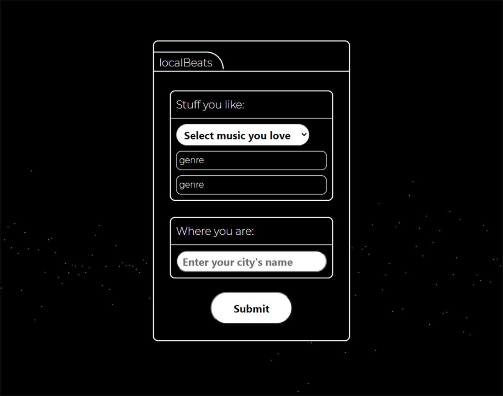
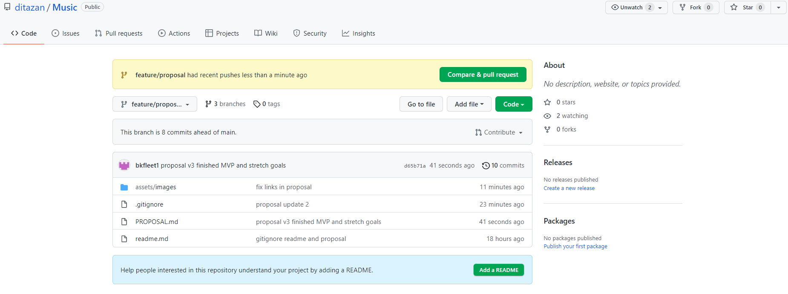
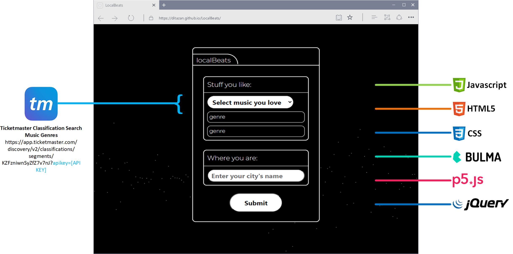
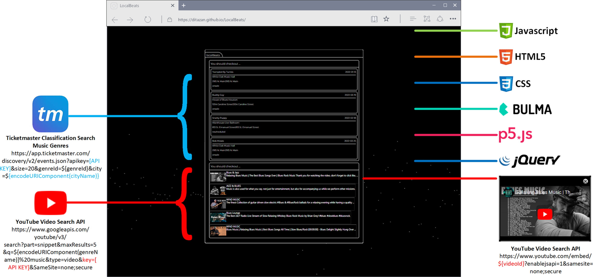

# Local Beats

## Purpose
Local Beats is a music-lover's application that combines your musical interest and location to provide music videos from great artists and live events happening in your area. 

## Description
 LocalBeats is a mobile-responsive, web application that provides you with music videos and live events in your area. select the genre of music that you enjoy listening to and enter city you live in click search. LocalBeats will then find content from YouTube (videos) and events from Ticketmaster that match your preferences. You can click a live event card to purchase ticket from Ticketmaster or watch an artist's video by clicking on the YouTube cards. You can also expect the content to always be fresh, because its dynamically assembled using RESTful APIs. 

## Application
Deployed Application - https://ditazan.github.io/LocalBeats/

GitHub Repository - https://github.com/ditazan/LocalBeats

## Developers
1. [Dita Zanelli](https://github.com/ditazan)
2. [Buyankhishig Jamsran](https://github.com/buykajamsran)
2. [Jamie Jackson](https://github.com/JJackson510)
4. [Brad Kelley](https://github.com/bkfleet1)

## Application Technology 
LocalBeats' framework consists of several different coding, styling, and application program interface (API) resources, which are illustrated and cited in the following sections.

### Application Technology - Search UI

### Application Technology - Results UI

### Coding Resoures
> - HTML5
> - JavaScript
> - [JQuery](https://jquery.com/)

### Styling Resources
> - CSS
> - [Bulma CSS Framework](https://bulma.io/)
> - [P5](https://p5js.org/)
> - [Google Fonts](https://fonts.googleapis.com)

### Application Program Interface (API) Resources
> - [Ticketmaster Event Search](https://developer.ticketmaster.com/products-and-docs/apis/discovery-api/v2/#search-events-v2)
> - [Ticketmaster Classification Search](https://developer.ticketmaster.com/products-and-docs/apis/discovery-api/v2/#search-classifications-v2)
> - [YouTube Video Search API](https://developers.google.com/youtube/v3/docs/search/list)
> - [P5-JS](https://p5js.org/) 
> - [Bulma CSS Framework](https://bulma.io/)

## Acknowledgements
> - Ticketmaster: Provides API endpoints for both the music genres (i.e., Ticketmaster Classification Search) and live events (i.e., Ticketmaster Event Search) content included in LocalBeats. 
>>> [Ticketmaster](https://www.ticketmaster.com/)
> - Google: Provides both the font styling (i.e., Google Fonts) and YouTube video API endpoint, as well as streaming video content in LocalBeats. 
>>> [Google](https://www.google.com/)
> - Bulma: provides the application's mobile-responsive features for the user-interface.
>>> [Bulma](https://bulma.io/)
> - P5-JS: Provides the animated "noise" background found in LocalBeats UI.
>>> [P5-JS](https://p5js.org/) 
> - Jquery: Provides various development coding functions that enable LocalBeat's features, API data calls, and other application logic behind the scenes.
>>> [JQuery](https://jquery.com/)

